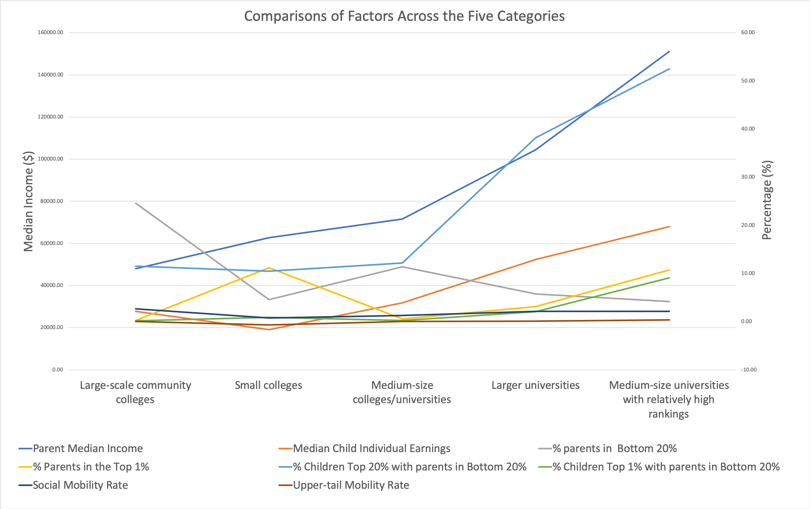

# 0403-CollegeMobilityRate_Sanny-YE
# College Social Mobility Rate Cluster Analysis
## Background 
Social mobility is a hot topic in education research. Finding general patterns of how students from different social-economic class choose what type of college to attend is important in terms of predicting their future income and the possibility of them having the opportunity to move up in the income distribution spectrum (Koenig, 2019). In this project, I worked with data from the Opportunity Insights website to explore how colleges are grouped and categorized based on metrics related to social mobility. By running a cluster analysis on the Mobility Report Cards: Preferred Estimates of Access and Mobility Rates by College data, I was able to mathematically determine the relationship between data points and divide them into groups based on their similarities and how closely they resemble each other in terms of trends and relationship between different factors. 

The 2202 data points gathered in the dataset represent 2202 schools in the U.S., including universities, liberal-arts colleges and community colleges in different states all over the country. The schools are clustered based on the following factors:

1)	Median parent household income (par_median),
2)	Median child individual earnings in 2014 (k_median),
3)	Fraction of parents in the Bottom 20% of the income distribution (par_q1),
4)	Fraction of parents in the Top 1% of the income distribution (par_top1pc),
5)	Percent of children who reach the Top 20% of the income distribution among children with parents in the Bottom 20% of the income distribution (kq5_cond_parq1),
6)	Percent of children who reach the Top 1% of the income distribution among children with parents in the Bottom 20% of the income distribution (ktop1pc_cond_parq1),
7)	Mobility Rate (percent of students who have parents in the Bottom 20% of the income distribution and reach the Top 20% of the income distribution) (mr_kq5_pq1),
8)	Upper-tail Mobility Rate (percent of students who have parents in the Bottom 20% of the income distribution and reach the Top 1% of the income distribution) (mr_ktop1_pq1),
9)	Change in percentage of parents from the bottom 20% of the income distribution between the 1980 and 1991 cohorts (trend_parq1), 
10)	Change in percentage of parents from the bottom 40% of the income distribution between the 1980 and 1991 cohorts (trend_bottom40), and 
11)	Average number of children per cohort (count).

By using the Solver in excel and grouping the schools into five groups, we are able to see how students’ financial circumstances affect their choices of which school to attend, and how possible it is for students to flow from unprivileged socio-economic class to a more privileged one after college.

### Industry Question
How are students’ financial circumstances affect which schools they choose to attend? Is there a general pattern of what type of colleges tend to have a higher social mobility rate?
### Data Question 
How are different colleges grouped based on metrics related to parent/children income and social mobility?

## Data Analysis: Clustering the Schools

Using the Solver, the 2202 schools are grouped into five categories, with Merced Community College, Seattle University, Brandeis University, Minneapolis College of Arts & Design and Metropolitan Community College of Omaha, NE as representatives of each. Based on the average number of children per cohort and other characteristics, the five groups can be generalized as:
1)	Large-scale community colleges with low median parent household income, low median child individual earnings, a high fraction of parents in the Bottom 20% of the income distribution, and a low fraction of parents in the Top 1% of the income distribution;
2)	Medium-to-large-scale universities with above-average median parent household income, above-average median child individual earnings, a relatively low fraction of parents in the Bottom 20% of the income distribution, and a relatively high fraction of parents in the Top 1% of the income distribution;
3)	Medium-size elite universities (mostly ranked high in national colleges rankings) with high median parent household income, high median child individual earnings, a low fraction of parents in the Bottom 20% of the income distribution, and a high fraction of parents in the Top 1% of the income distribution;
4)	Small colleges (mostly liberal arts colleges) with above-average median parent household income, below-average median child individual earnings, a below-average fraction of parents in the Bottom 20% of the income distribution, and an above-average fraction of parents in the Top 1% of the income distribution; and 
5)	Medium-size college/university (including medium-size state schools or community colleges) with average median parent household income, below-average median child individual earnings in 2014, an average fraction of parents in the Bottom 20% of the income distribution, and a relatively low fraction of parents in the Top 1% of the income distribution.

## Conclusion
Based on the cluster analysis, we can summarize our findings as the following points: 1) students who attend large-scale community colleges tend to come from families with lower household income, but the social mobility rate of those schools tend to be the highest; whereas small colleges with relatively high parent income and more parents in the top 1% have the lowest mobility rate; 2) medium-size colleges/universities with average parent income has an average social mobility rate; 3) Although the mobility rate of larger universities and medium-size elite universities are the same, universities with higher rankings have a higher upper-tail mobility rate, which means that the percentage of students who have parents in the Bottom 20% of the income distribution and reach the Top 1% of the income distribution is the highest of all.

## Additional Links
1) Data Source: https://opportunityinsights.org/data/?geographic_level=100&topic=105&paper_id=0#resource-listing 
2) http://www.equality-of-opportunity.org/college/
3) https://www.edsurge.com/news/2019-09-09-colleges-reinforce-inequality-rather-than-social-mobility-new-book-argues
